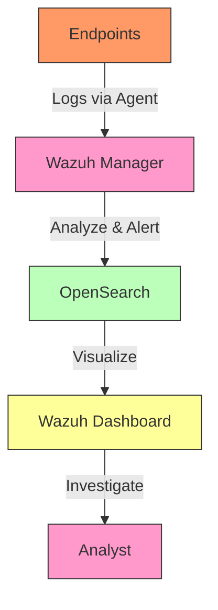

# 🛡️ Home SIEM Lab (Wazuh)

> Self-hosted Security Information and Event Management (SIEM) system for threat detection and incident response.

**Status:** Complete | **License:** MIT | **Last Updated:** March 2026
## 📖 Overview
This project documents the deployment of a **Wazuh SIEM** in a home lab environment for security monitoring, log analysis, and incident response training. The setup includes a Wazuh manager, indexed logs via OpenSearch, and multiple monitored endpoints.
## 🛠️ Technologies Used
| Category | Technology | Purpose |
| :--- | :--- | :--- |
| **SIEM** | Wazuh | Threat detection, log analysis, compliance monitoring |
| **Database** | OpenSearch | Log storage and visualization |
| **Endpoints** | Metasploitable 2, Windows 10 | Simulated vulnerable systems for testing |
| **Virtualization** | Proxmox VE, Docker | Containerized Wazuh deployment |
| **OS** | Ubuntu 22.04, Debian 12 | Manager and agent operating systems |
## 🏗️ Architecture

